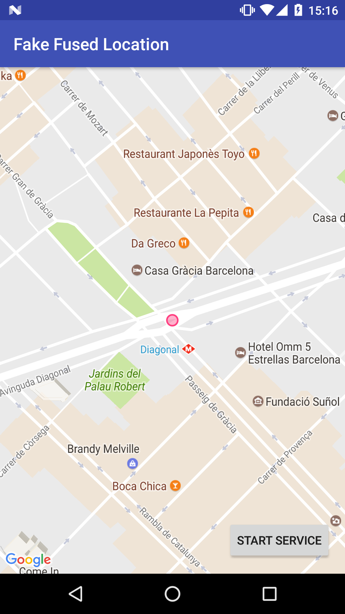

# Fake Fused Location

Android app that can be used by developers to mock GPS locations while developing. This app makes use of
Google Play Services [setMockLocation()](https://developers.google.com/android/reference/com/google/android/gms/location/FusedLocationProviderApi.html#setMockLocation(com.google.android.gms.common.api.GoogleApiClient,%20android.location.Location))
method to ensure that [FusedLocationApi](https://developers.google.com/android/reference/com/google/android/gms/location/LocationServices.html#FusedLocationApi)
doesn't mix mocked locations with WIFI and sensor ones, avoiding in this way the typical jumping from
one place to another that often happens when using other GPS mocking apps.



## Build instructions

In order to build the app first you'll need a Google Map Api key to configure the app. To obtain an API key go to
https://console.developers.google.com/ and create a project or select an existing one. Then:

1. Go to credentials.
2. Create a credential API key.
3. Copy the key.
4. Create a file called `gradle.properties` inside `~/.gradle/` dir from home folder.
5. Open the file an add the following line: `fakeFusedLocationGoogleMapsApi=PASTE_YOUR_KEY_HERE`.

### Release build

In order make a release build you'll need to sign the app. The project doesn't include any certificate to sign
the app, so you'll need to provide one yourself. When your certificate is ready to be used, please 
configure the following properties inside `gradle.properties` file:

```
fakeFusedLocationKeyAlias=KEY_ALIAS
fakeFusedLocationKeyPassword=KEY_PASSWORD
fakeFusedLocationStoreFile=STORE_FILE
fakeFusedLocationStorePassword=STORE_PASSWORD
```
